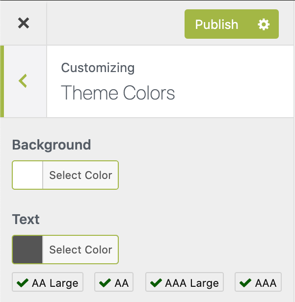

# WordPress Customizer: Color Contrast Control

 <div style="text-align:center">
    
 </div>

 The IA Color Contrast control is a custom `WP_Customize_Control` for use in the WordPress Customizer.
 
 It is intended for use by WordPress theme developers who would like to add a contrast check to their theme color options in
 the customizer. Because it is intended to be used as a part of a custom theme, this repository is not a full plugin. Instead,
 theme developers are encouraged to drop the files into a theme project and alter the paths and text domain. This control 
 should be compliant with the Theme Review guidelines for wordpress.org theme submission. 
 
 ## Installation
 
 The code is intended to be added to the theme's includes directory (the directory is named `/inc` in underscores, the 
 starter theme from WordPress), then `require_once` in the theme's `customize.php` file (again, in underscores, `/inc/customize.php`).
 
 If you add the files in your theme at another location, you will need to update the paths to the JavaScript and CSS files. 
 These are located in the `class-ia-color-contrast-customize-control.php` file, in the `enqueue` method. 
 
 If you would prefer to use the text domain of your theme, you can replace the domain `ia-color-contrast` with your own. There
 should be *five instances* in the `class-ia-color-contrast-customize-control.php` file (in the call to 
 `wp_set_script_translations` and in the HTML portion of the `content_template` method) and
 *four instances* in the `ia-color-contrast-customize-control.js` file (in the `update` method).
 
 If at all possible, please leave the PHP, JavaScript and CSS file comment headers in place. 
 
 ## Usage
 
 Before you get started, you should be familiar with the basics of the using the 
 [WordPres Customizer API](https://developer.wordpress.org/themes/customize-api/)
 to create custom colors within your theme. 
 
 This control is intended to be paired with *two* `WP_Customize_Color_Control`s and their settings. Add the two settings IDs
 to in the options parameter of the `IA_Color_Contrast_Customize_Control` constructor. 
 
 The `IA_Color_Contrast_Customize_Control` is designed to 'stick' to the previously added `WP_Customize_Color_Control`, so should
 be added to the customizer immediately after, or given a priority after, the corresponding `WP_Customize_Color_Control`.
 
 ### Example
 ```php
$wp_customize->add_control( 
    new WP_Customize_Color_Control( 
        $wp_customize, 
        'link_color',
         array(
            'label'    => 'Link Color',
            'section'  => 'theme_colors',
            'settings' => 'link_color',
         )
    )
);
$wp_customize->add_control( 
    new IA_Color_Contrast_Customize_Control( 
        $wp_customize, 'body_text_color_contrast', 
        array(
            'section'  => 'theme_colors',
            'settings' => array(
                'body_background_color',
                'body_text_color'
            )
        ) 
    )
);
```

 
Here's a fully functional (if simplistic) `customize.php` example:
```php
require_once get_theme_file_path( '/inc/ia-cc/class-ia-color-contrast-customize-control.php' );

function my_theme_customize_register( $wp_customize ) {
    $wp_customize->add_section( 'my_theme_colors', array(
		'title'    => 'Theme Colors',
		'priority' => 30,
	) );
    $wp_customize->add_setting( 'body_background_color', array(
		'default'   => '#fff',
		'transport' => 'refresh',
	) );
	$wp_customize->add_setting( 'body_text_color', array(
		'default'   => '#555',
		'transport' => 'refresh',
	) );
    $wp_customize->add_control( new WP_Customize_Color_Control( $wp_customize, 'body_background_color', array(
		'label'    => 'Background',
		'section'  => 'my_theme_colors',
		'settings' => 'body_background_color',
	) ) );

	$wp_customize->add_control( new WP_Customize_Color_Control( $wp_customize, 'body_text_color', array(
		'label'    => 'Text',
		'section'  => 'my_theme_colors',
		'settings' => 'body_text_color',
	) ) );
	$wp_customize->add_control( new IA_Color_Contrast_Customize_Control( $wp_customize, 'body_color_contrast', array(
		'section'  => 'my_theme_colors',
		'settings' => array(
			'body_background_color',
			'body_text_color'
		)
	) ) );
}
add_action( 'customize_register', 'my_theme_customize_register' );

function my_theme_customizer_css() {
	?>
	<style id="customizer-styles" type="text/css">
		body {
			background-color : <?php echo get_theme_mod('body_background_color', '#fff'); ?>;
			color            : <?php echo get_theme_mod('body_text_color', '#555'); ?>;
		}
	</style>
	<?php
}

add_action( 'wp_head', 'my_theme_customizer_css' );
```
## Acknowledgements

Much of the code used in the JavaScript files originated with the article 
[Building your own color contrast checker](https://dev.to/alvaromontoro/building-your-own-color-contrast-checker-4j7o)
 by [Alvaro Montoro](https://twitter.com/alvaro_montoro).
 
 As indicated in the article above, the `rgbToHex` method originated with Tim Down on 
 [StackOverflow](https://stackoverflow.com/questions/5623838/rgb-to-hex-and-hex-to-rgb/5624139#5624139).
